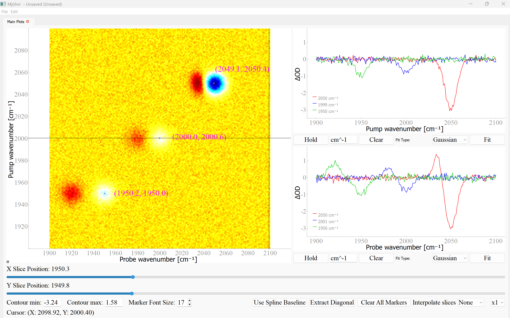

# MjÖlnir

**MjÖlnir** is a streamlined, user-friendly tool for visualizing and analyzing two-dimensional datasets without the need to write repetitive Python or MATLAB code. It’s designed to simplify your workflow by letting you inspect, process, and export results quickly while keeping all your work organized in one place. The goal is to reduce complexity so your data isn’t just seen, but clearly understood. Why this name? No reason. Most good names I thought of were already available as softwares, so I went name I liked and stays unique :)

---

## 📌 Scope

Originally built for 2D infrared (2DIR) spectroscopy, MjÖlnir is versatile enough to handle a wide range of other 2D datasets. Whether you're working with excitation–emission matrices, 2D fluorescence spectra, 2D electronic spectra, or any other dataset arranged in an X–Y–Z format, this tool adapts effortlessly to your needs. A picture of the window is given below 

---

## ⚙️ Core Analytical Features

One of the things I like of MjÖlnir is its peak detection. Using a Laplacian-based algorithm, it can accurately identify peaks even in noisy datasets. Sensitivity can be adjusted, giving you precise control over the detection process.

For deeper analysis, the tool makes it easy to extract and examine cross-sections along both the pump and probe axes. You can fit these slices interactively with just mouse draging and overlay multiple cross-sections for direct, side-by-side comparison.

Background artifacts are handled automatically through spline-based baseline correction. To make sure the correction meets your standards, a visual preview is provided.

When it’s time to present your results, MjÖlnir offers one-click export options in vector formats like SVG, PNG or the data itself. You can customize axis labels, color scales, and gridlines to match your expectation, ensuring your figures are ready for publication with less formatting work.

---

## 📥 Data Import Format

To keep the analysis consistent and avoid ambiguity, MjÖlnir works with 2D spectral data saved in a standardized matrix format. In this setup, the first row should contain your probe (X-axis) values, while the first column contains the pump (Y-axis) values. The remaining cells hold the Z-data aligned to these dimensions.

For reliable interpretation across different systems and regional settings, files must use commas `,` as delimiters and periods `.` as decimal points. For example, a valid data point would look like `1950.5`.

This clear and simple format ensures that your data loads correctly every time, with no guesswork about axis assignments or number formatting. 

---
## ✏️ Author's Note

This project was developed independently, without external funding or institutional support. It evolved from a matplotlib-based interactive plotting tool I created I created and later I converted it to MjÖlnir (Pyqt based) with the help of AI tools like Gemini 2.5 flash and Deep seek-R1. It was a personal tool to simplify my own data analysis workflow, and now it is available for other users. 

---

## 📬 Contact

If you have any questions, suggestions, or improvements for MjÖlnir, feel free to reach out at mathesh.vaithiyanathan@fu-berlin.de

